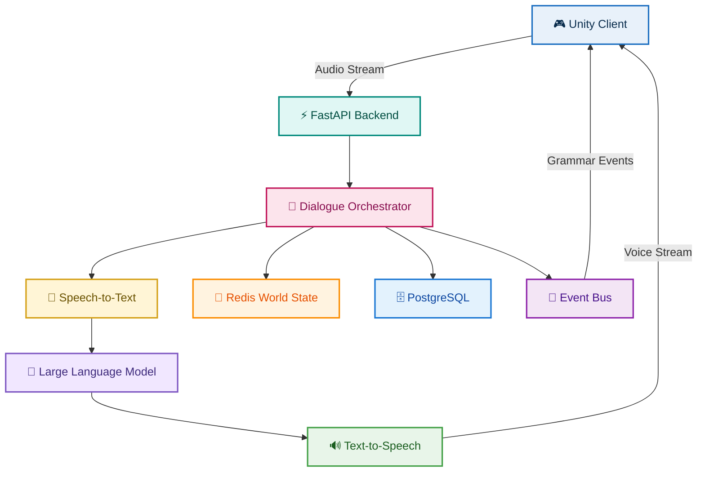

# VirtuLingo Backend
VirtuLingo transforms language learning by placing learners inside realistic VR conversations with AI-powered virtual characters. Instead of memorizing vocabulary or repeating textbook drills, users build true fluency through natural, contextual, spoken interaction in a safe, judgment-free world.

Designed for young learners, beginners, and people who struggle with verbal communication, VirtuLingo blends VR immersion + AI language intelligence to provide human-like conversations, instant feedback, and scenario-based learning.
---

## **Features**

- Personalized, dynamic conversations that respond to the user’s speech
- Multiple real-life VR scenarios (restaurants, supermarkets, offices, etc.)
- Real-time feedback on pronunciation, grammar, and fluency
- Context-aware vocabulary guidance during interactions
- AI-driven conversation partners with adaptive difficulty
- Safe, goal-oriented, judgment-free speaking environment
- World-state aware conversations

---

# **INTERFACE OVERVIEW**

<div align="center">


<br/>

<br/>


</div>

---

# **TECH STACK & ARCHITECTURE**

<table>
<tr>
<td width="260" valign="top">

### **Tech Stack**

<table>

<tr>
<td align="center">

<b style="font-size:16px;">UNITY CLIENT</b>

<br/><br/>

<code style="font-size:15px;">Unity • C# • WebSockets</code>

<br/><br/>

<strong>Voice Chat • NPC Interaction • World Events</strong>

</td>
</tr>

<tr><td align="center"><strong>↓ WebSocket + REST</strong></td></tr>

<tr>
<td align="center">

<b style="font-size:16px;">FASTAPI BACKEND</b>

<br/><br/>

<code style="font-size:15px;">FastAPI</code>

<br/><br/>

<strong>REST API • WebSockets • Event Routing</strong>

</td>
</tr>

<tr><td align="center"><strong>↓</strong></td></tr>

<tr>
<td align="center">

<b style="font-size:16px;">APPLICATION LAYER</b>

<br/><br/>

<code style="font-size:15px;">Python</code>

<br/><br/>

<strong>Dialogue Orchestrator • Grammar Manager • World State Manager</strong>

</td>
</tr>

<tr><td align="center"><strong>↓</strong></td></tr>

<tr>
<td align="center">

<b style="font-size:16px;">AI SERVICES</b>

<br/><br/>

<code style="font-size:15px;">Groq • Azure STT • Azure TTS</code>

<br/><br/>

<strong>Speech Recognition • LLM • Voice Synthesis</strong>

</td>
</tr>

<tr><td align="center"><strong>↓</strong></td></tr>

<tr>
<td align="center">

<b style="font-size:16px;">DATA LAYER</b>

<br/><br/>

<code style="font-size:15px;">Redis • PostgreSQL</code>

<br/><br/>

<strong>World State • Conversation History • Player Progress</strong>

</td>
</tr>

</table>

</td>

<td width="1000" valign="center" align="center">

### **Visual Flow**



</td>
</tr>
</table>

---

## System Modules

<table>

<tr>
<td colspan="2"><strong>CONVERSATION ENGINE</strong></td>
</tr>

<tr>

<td width="40%">

Coordinates the complete voice conversation pipeline between the player and NPCs.

<br><br>

• WebSocket communication

• Streaming dialogue

• Context injection

• NPC response generation

• Conversation history

</td>

<td width="60%">


</td>

</tr>

<tr>
<td colspan="2"><strong>GRAMMAR ANALYSIS MODULE</strong></td>
</tr>

<tr>

<td width="40%">

Analyzes player speech asynchronously without interrupting gameplay.

<br><br>

• Grammar correction

• Mistake detection

• Structured feedback

• Progress tracking

• Event notifications

</td>

<td width="60%">


</td>

</tr>

<tr>
<td colspan="2"><strong>WORLD STATE MODULE</strong></td>
</tr>

<tr>

<td width="40%">

Maintains contextual information about the player's environment.

<br><br>

• Player position

• Nearby NPCs

• Active quests

• Inventory

• Scene context

</td>

<td width="60%">


</td>

</tr>

<tr>
<td colspan="2"><strong>VOICE PROCESSING MODULE</strong></td>
</tr>

<tr>

<td width="40%">

Handles the complete speech pipeline.

<br><br>

• Speech-to-Text

• Streaming transcription

• Text-to-Speech

• Audio streaming

• Low-latency processing

</td>

<td width="60%">


</td>

</tr>


</table>

---

## **Installation**

### **1. Clone the Repository**

```bash
git clone https://github.com/Kathirvelan213/virtulingo-backend.git

cd virtulingo-backend
```

---

### **2. Create Virtual Environment**

```bash
uv venv

source .venv/bin/activate

# Windows

.venv\Scripts\activate
```

---

### **3. Install Dependencies**

```bash
uv sync
```

---

### **4. Configure Environment Variables**

Create a `.env` file.

```env
GROQ_API_KEY=YOUR_API_KEY

AZURE_SPEECH_KEY=YOUR_KEY

AZURE_SPEECH_REGION=YOUR_REGION

SUPABASE_DB_URL=YOUR_DATABASE_URL

REDIS_URL=redis://localhost:6379/0
```

---

### **5. Run Redis**

```bash
docker run -p 6379:6379 redis
```

---

### **6. Start the Backend**

```bash
uvicorn main:app --reload
```

---

## Future Improvements

- Multi-language conversations
- Emotion-aware NPC responses
- Voice cloning for NPCs
- Multiplayer cooperative learning
- WebRTC-based audio streaming
- Distributed event bus
- Horizontal scaling
- Prompt caching
- AI-powered pronunciation scoring
- Analytics dashboard

---

## License

This project is licensed under the MIT License.
